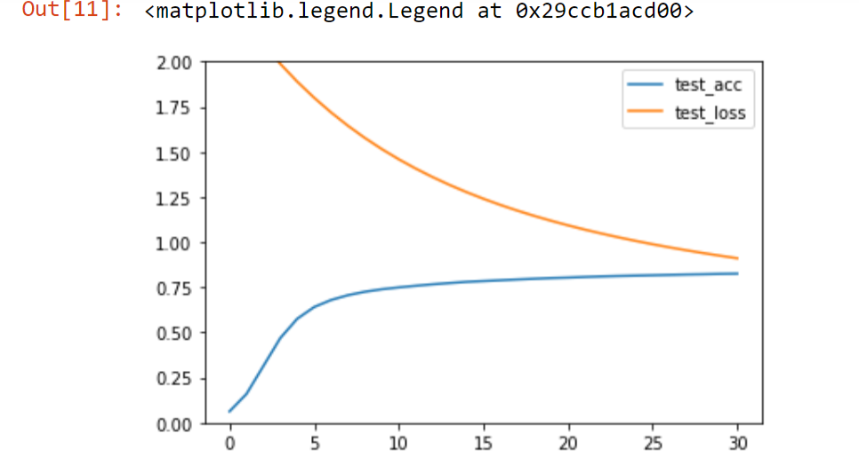
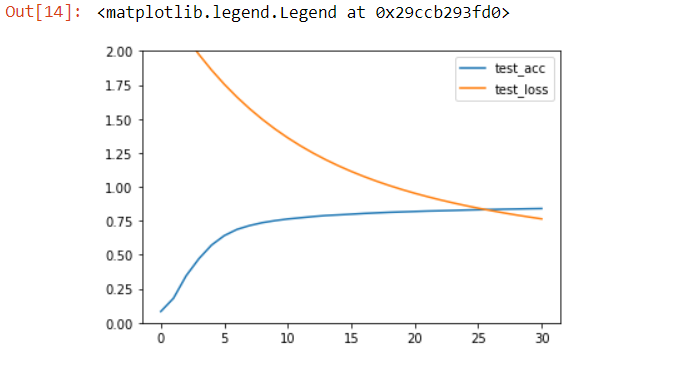
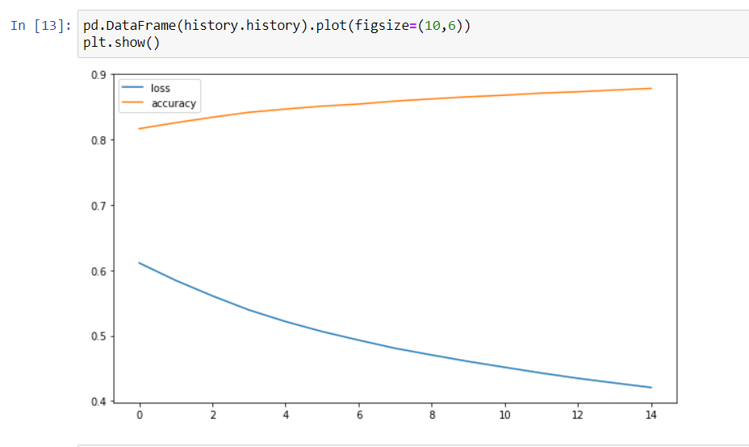
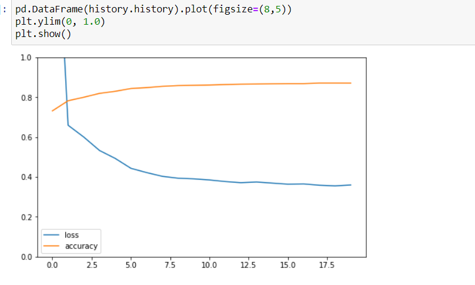

# Лабораторная работа по курсу "Искусственный интеллект"
# Многослойный персептрон

| Студент | *Лебеденко Алёна* |
|------|------|
| Группа  | *301Б* |
| Оценка 1 (свой фреймворк) | *X* |
| Оценка 2 (PyTorch/Tensorflow) | *X* |
| Проверил | Сошников Д.В. |

> *Комментарии проверяющего*
### Задание

Решить задачу классификации для датасетов MNIST, FashionMNIST, CIFAR-10 с помощью 1, 2 и 3-слойного персептрона. Попробовать разные передаточные функции, провести сравнительную оценку решений. Решение сделать двумя способами:
* "С нуля", на основе базовых операций библиотеки numpy. Решение желательно реализовать в виде библиотеки, пригодной для решения более широкго круга задач.
* На основе одного из существующих нейросетевых фреймворков, в соответствии с вариантом задания:
   1. PyTorch
   1. Tensorflow/Keras

> *Номер варианта вычисляется по формуле 1 + (N-1) mod 2, где N - номер студента в списке.*

Решение оформить в файлах [Solution_MyFramework.ipynb](Solution_MyFramework.ipynb) и [Solution.ipynb](Solution.ipynb). 
Отчет по работе и сравнение методов пишется в этом файле после задания.
### Критерии оценки

Первая часть лабораторной работы:

| Сделано | Баллы |
|---------|-------|
| Реализован однослойный персептрон, классифицирующий датасет с точностью >85% | 1 |
| Реализован многослойный персептрон, классифицирующий датасет с точностью >85% | 2 |
| Реализация сделана как библиотека для обучения сетей различных конфигураций, в соответствии с примером | 1 |
| Улучшена архитектура библиотеки, отдельно вынесены алгоритмы обучения, функции потерь | 3 |
| Проведено сравнение различных гиперпараметров, таких, как передаточные функции, число нейронов в промежуточных слоях, функции потерь, с графиками обучения и матрицами неточности | 2 |
| Проведен анализ для датасета FashionMNIST | 1 |

Вторая часть лабораторной работы:

| Сделано | Баллы |
|---------|-------|
| Реализован однослойный персептрон, классифицирующий датасет с точностью >85% | 1 |
| Реализован многослойный персептрон, классифицирующий датасет с точностью >85% | 2 |
| Реализация использует возможности базового фреймворка, включая работу с данными | 3 |
| Проведено сравнение различных гиперпараметров, таких, как передаточные функции, число нейронов в промежуточных слоях, функции потерь, с графиками обучения и матрицами неточности | 2 |
| Проведен анализ для датасета FashionMNIST | 1 |
| Проведен анализ для другого датасета с цветными картинками (CIFAR-10) | 1 |

## Отчёт по работе

### Часть 1

Загружаем датасет и разделяем на тренировочную и тестовую выборки

      import pickle
      with open('mnist.pkl','rb') as f:
          MNIST = pickle.load(f)
          
      import numpy as np
      
      labels = MNIST['Train']['Labels']
      data = MNIST['Train']['Features'].astype(np.float32)/256
      from sklearn.model_selection import train_test_split
      train_data, test_data, train_labels, test_labels = train_test_split(data, labels, stratify=labels,test_size=0.25)
      
Задаем нейросетевую модель:
      
      class Linear:
          def __init__(self,nin,nout):
              self.W = np.random.normal(0, 1.0/np.sqrt(nin), (nout, nin))
              self.b = np.zeros((1,nout))
              self.dW = np.zeros_like(self.W)
              self.db = np.zeros_like(self.b)

          def forward(self, x):
              self.x=x
              return np.dot(x, self.W.T) + self.b

          def backward(self, dz):
              dx = np.dot(dz, self.W)
              dW = np.dot(dz.T, self.x)
              db = dz.sum(axis=0)
              self.dW = dW
              self.db = db
              return dx

          def update(self,lr):
              self.W -= lr*self.dW
              self.b -= lr*self.db
       
       class Softmax:
          def forward(self,z):
              self.z = z
              zmax = z.max(axis=1,keepdims=True)
              expz = np.exp(z-zmax)
              Z = expz.sum(axis=1,keepdims=True)
              return expz / Z
          def backward(self,dp):
              p = self.forward(self.z)
              pdp = p * dp
              return pdp - p * pdp.sum(axis=1, keepdims=True)
              
      class CrossEntropyLoss:
          def forward(self,p,y):
              self.p = p
              self.y = y
              p_of_y = p[np.arange(len(y)), y]
              log_prob = np.log(p_of_y)
              return -log_prob.mean()
          def backward(self,loss):
              dlog_softmax = np.zeros_like(self.p)
              dlog_softmax[np.arange(len(self.y)), self.y] -= 1.0/len(self.y)
              return dlog_softmax / self.p
              
Для удобства опишем класс, который позволяет объединять узлы вычислительного графа в единую сеть, и применять функции forward и backward сразу ко всей сети последовательно:
              
      class Net:
          def __init__(self):
              self.layers = []

          def add(self,l):
              self.layers.append(l)

          def forward(self,x):
              for l in self.layers:
                  x = l.forward(x)
              return x

          def backward(self,z):
              for l in self.layers[::-1]:
                  z = l.backward(z)
              return z

          def update(self,lr):
              for l in self.layers:
                  if 'update' in l.__dir__():
                      l.update(lr)

          def compile(self, loss=None, metrics=["accuracy"]):
              self.loss = loss
              self.metrics = metrics

          def get_loss_acc(self, x, y):
              p = self.forward(x)
              l = self.loss.forward(p,y)
              pred = np.argmax(p,axis=1)
              acc = (pred==y).mean()
              return l, acc

          def fit(self, X_train, y_train, batch_size=4, epochs=10, validation_data=None, lr=0.3):
              X_test, y_test = validation_data
              history = []
              train_loss, train_acc = self.get_loss_acc(X_train, y_train)
              test_loss, test_acc = self.get_loss_acc(X_test, y_test)
              history.append([train_acc,train_loss,test_acc,test_loss])

              for i in range(4):
                  print(f"Initial {['train_acc','train_loss','test_acc','test_loss'][i]}: {history[-1][i]}")

              for epo in range(epochs):
                  for i in range(0,len(X_train),batch_size):
                      xb = X_train[i:i+batch_size]
                      yb = y_train[i:i+batch_size]
                      p = self.forward(xb)
                      l = self.loss.forward(p,yb)
                      dp = self.loss.backward(l)
                      dx = self.backward(dp)
                      net.update(lr)
                  train_loss, train_acc = self.get_loss_acc(X_train, y_train)
                  test_loss, test_acc = self.get_loss_acc(X_test, y_test)
                  history.append([train_acc,train_loss,test_acc,test_loss])
                  print(f"epoch: {epo+1}/{epochs}")
                  for i in range(4):
                      print(f"{['train_acc','train_loss','test_acc','test_loss'][i]}: {history[-1][i]}")
              return history
              
 Создаем и обучаем нейросеть:
              
       net = Net()
       net.add(Linear(784, 10))
       net.add(Softmax())
       net.compile(loss=CrossEntropyLoss())

       hist = net.fit(train_data,train_labels, lr=0.001, epochs=30, batch_size=256, validation_data=(test_data,test_labels))
       

       
Передаточная функция:
       
       class Tanh:
          def forward(self,x):
              y = np.tanh(x)
              self.y = y
              return y
          def backward(self,dy):
              return (1.0-self.y**2)*dy
            
Создаем и обучаем многослойную модель:
            
       net = Net()
       net.add(Linear(784, 300))
       net.add(Tanh())
       net.add(Linear(300,10))
       net.add(Softmax())
       loss = CrossEntropyLoss()

       net.compile(loss=CrossEntropyLoss())

       hist = net.fit(train_data, train_labels, lr=0.001, epochs=30, batch_size=256, validation_data=(test_data,test_labels))
    

### Часть 2

Импортируем нужные библиотеки

      import matplotlib.pyplot as plt 
      import pandas as pd
      import numpy as np
      import tensorflow as tf
      import keras
      print("tensorflow version: "+tf.__version__)
      print("keras version: "+keras.__version__)
      
Загружаем датасет и разделяем на тренировочную и тестовую выборки

      import pickle
      with open('mnist.pkl','rb') as f:
          MNIST = pickle.load(f)

      labels = MNIST['Train']['Labels']
      data = MNIST['Train']['Features'].astype(np.float32)/256

      from sklearn.model_selection import train_test_split
      train_data, test_data, train_labels, test_labels = train_test_split(data, labels, stratify=labels,test_size=0.2)
      test_data = np.array([data / 255 for data in test_data])
      train_data = np.array([data / 255 for data in train_data])

#### Keras

Создаем молель

      model = tf.keras.models.Sequential([
        tf.keras.layers.Flatten(input_shape=(784,)),
        tf.keras.layers.Dense(10, activation='relu'),
        tf.keras.layers.Dense(10, activation='relu'),
        tf.keras.layers.Dense(10)
      ])

      loss_fn = tf.keras.losses.SparseCategoricalCrossentropy(from_logits=True)

      model.compile(optimizer='adam',
                    loss=loss_fn,
                    metrics=['accuracy'])
              
Обучение модели
              
      history = model.fit(train_data, train_labels, epochs=15)

Смотрим точность на тестовое выборке

      model.test_on_batch(test_data ,test_labels)  
Вывод:
      [0.4431709945201874, 0.8720238208770752]

Для Fasion MNIST

      (train_data, train_labels), (test_data ,test_labels) = tf.keras.datasets.fashion_mnist.load_data()
      model = tf.keras.models.Sequential([
        tf.keras.layers.Flatten(input_shape=(28,28)),
        tf.keras.layers.Dense(128, activation='relu'),
        tf.keras.layers.Dense(128, activation='relu'),
        tf.keras.layers.Dense(10)
      ])
      loss_fn = tf.keras.losses.SparseCategoricalCrossentropy(from_logits=True)
      model.compile(optimizer='adam',
                    loss=loss_fn,
                    metrics=['accuracy'])

      history = model.fit(x_train, y_train, epochs=20)

      model.test_on_batch(x_test,y_test)
   Вывод
      [0.4585808217525482, 0.8457000255584717]

####Tensorflow

      dataset = tf.data.Dataset.from_tensor_slices((train_data, train_labels.astype(np.float32)))
      dataset = dataset.batch(10)
      dataset

      optimizer = tf.keras.optimizers.Adam(0.01)

      learning_rate = 0.05

      W = tf.Variable(tf.random.normal(shape=(784,1)))
      b = tf.Variable(tf.zeros(shape=(10,1),dtype=tf.float32))

      @tf.function
      def train_on_batch(x, y):
        vars = [W, b]
        with tf.GradientTape() as tape:
          z = tf.matmul(x, W) + b
          loss = tf.reduce_mean(tf.nn.sparse_softmax_cross_entropy_with_logits(z,y))
          correct_prediction = tf.equal(tf.round(y), tf.round(z))
          acc = tf.reduce_mean(tf.cast(correct_prediction, tf.float32))
          grads = tape.gradient(loss, vars)
          optimizer.apply_gradients(zip(grads,vars))
        return loss,acc

      for epoch in range(40):
            for step, (x, y) in enumerate(dataset):
                  loss,acc = train_on_batch(tf.reshape(x,(-1,784)), tf.reshape(y,(10,-1)))
            print('Epoch %d: last batch loss = %.4f, acc = %.4f' % (epoch, float(loss),acc))

## Codespaces

По возможности, используйте GitHub Codespaces для выполнения работы. По результатам, дайте обратную связь:
1. Что понравилось
Работать с неёросетью

2. Что не понравилось?
Хотелось бы больше погрузится в тему на лекции.

3. Какие ошибки или существенные затруднения в работе вы встречали? (По возможности, будьте как можно более подробны, указывайте шаги для воспроизведения ошибок)
Работа с tensorflow, а именно с фанкцией sparse_softmax_cross_entropy_with_logits().

## Материалы для изучения

 * [Реализация своего нейросетевого фреймворка](https://github.com/shwars/NeuroWorkshop/blob/master/Notebooks/IntroMyFw.ipynb)
 * [Введение в PyTorch](https://github.com/shwars/NeuroWorkshop/blob/master/Notebooks/IntroPyTorch.ipynb)
 * [Введение в Tensorflow/Keras](https://github.com/shwars/NeuroWorkshop/blob/master/Notebooks/IntroKerasTF.ipynb)
